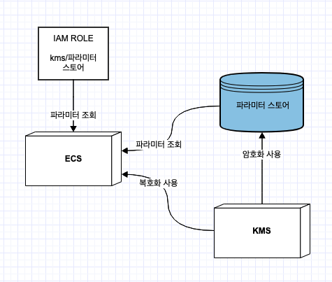

#### Fargate 시작 유형을 사용하는 Amazon ECS 클러스터를 가지고 있다. 환경 변수를 사용하여 데이터베이스 자격증명을 제공할때 적합한 솔루션

참고 자료

- https://aws.amazon.com/ko/premiumsupport/knowledge-center/ecs-data-security-container-task/
- https://docs.aws.amazon.com/ko_kr/AmazonECS/latest/developerguide/specifying-sensitive-data-parameters.html
- https://www.slideshare.net/awskorea/aws-system-manager-parameter-store-aws-aws-summit-seoul-2019

1. 민감 정보를 kms로 암호화 하여 파라미터 스토어 혹은 시크릿 매니저에 저장한다. 사용자 지정 key로 암호화 할 시 파라미터 스토어에 kms id를 주입한다
2. 파라미터 스토어 혹은 시크릿 매니저에서 데이터를 가져오는 권한과 kms 복호화 권한을 추가한 iam 역할을 생성한다.
3. 생성한 Iam 역할을 ecs 생성 과정에서 연결한다
4. Ecs 실행 환경변수에 파라미터 스토어/시크릿 매니저의 arn 정보를 추가한다
5. Ecs 실행시 해당 arn정보로 어플리케이션 개입 없이 인프라레벨에서 해당 파라미터 값을 복호화해 가져온다

